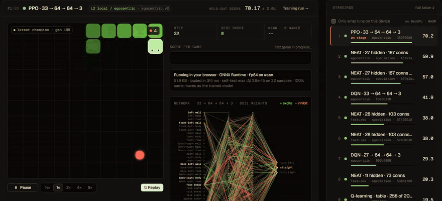
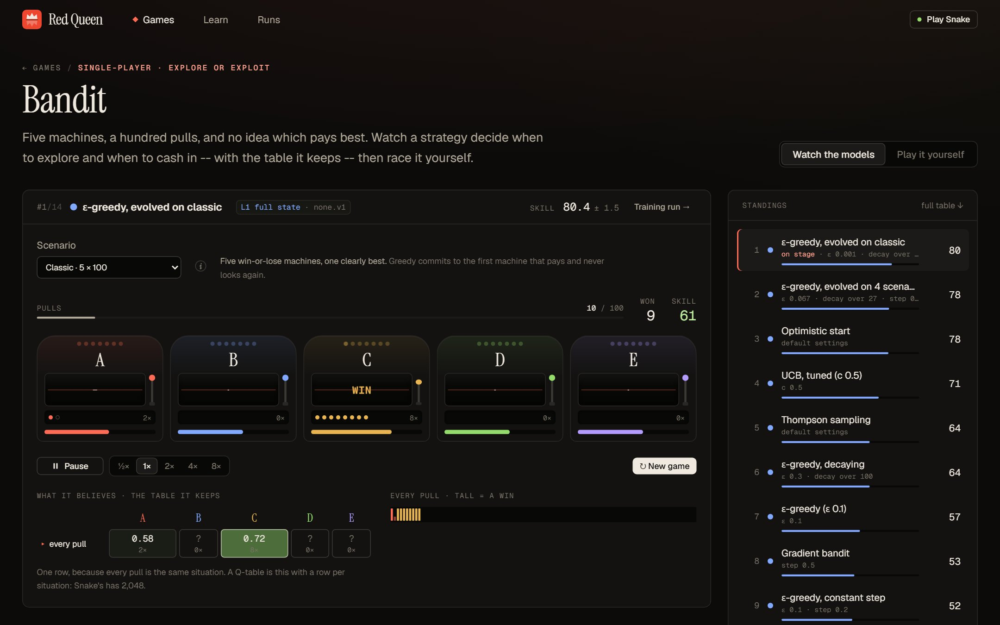
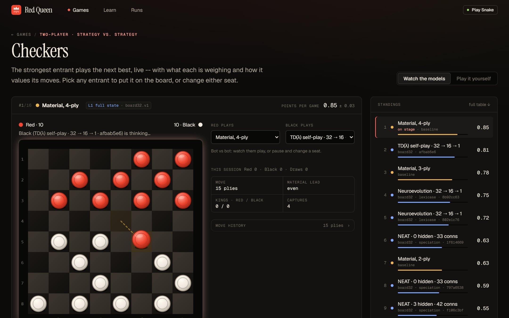
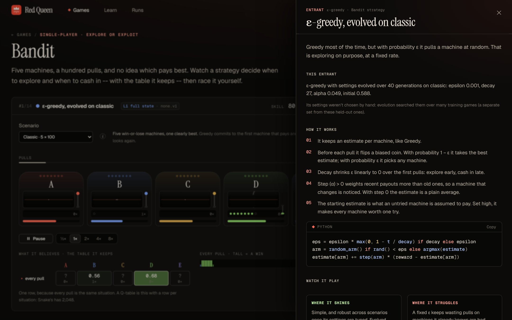
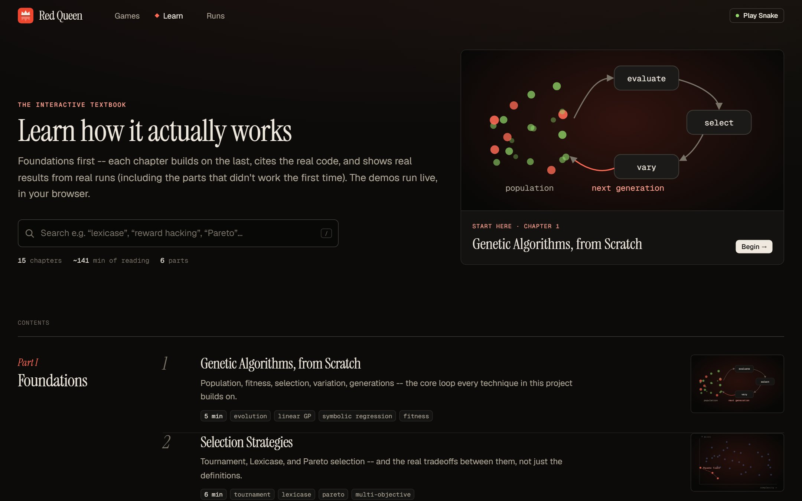
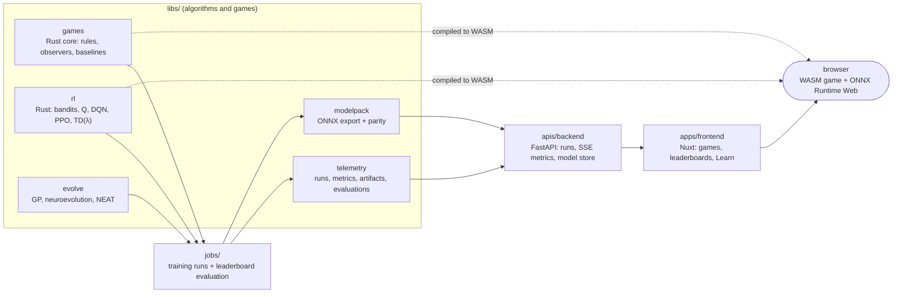

<div align="center">


# Red Queen

**Evolution and reinforcement learning, built from scratch and made visible.**

Genetic programming, neuroevolution, NEAT, Q-learning, DQN, PPO, self-play, bandits and a tiny transformer, each
implemented by hand. They compete on purpose-built games under one leaderboard, and you can watch every one of them
think, live in the browser.

</div>



> *"Now, here, you see, it takes all the running you can do, to keep in the same place."*
> The Red Queen, *Through the Looking-Glass*. The name is for the co-evolutionary arms race, where every
> improvement in one player is a new problem for another.

## What this is

A research playground and an interactive textbook in one monorepo:

- **Algorithms from first principles.** No PyTorch, no Gym, no NEAT-Python. Evolution loops, an autodiff engine, a
  batched MLP with hand-written backprop, Adam, replay buffers, GAE and PPO's clipped objective all live in this repo,
  with tests that check them against independent reference implementations.
- **Games built to expose algorithms.** Snake, Checkers and a multi-armed bandit are each chosen to make a particular
  idea visible. Examples: why representation matters more than compute, why lookahead beats evaluation, why exploring
  costs something. Every game's rules live once, in a Rust core that is bound to Python for training and compiled to
  WebAssembly for the browser, so a seed is the same game everywhere.
- **One honest leaderboard per game.** Entrants are scored on held-out seeds under a versioned protocol, never on
  training fitness. They sit beside fixed baselines, with confidence intervals and the measured cost to train and to
  run.
- **Everything runs in the browser.** Trained champions are exported as model packages and run in ONNX Runtime Web
  (WebGPU or WASM), with the game in WebAssembly, so watching or playing costs the server nothing per move.
- **A textbook that runs.** The `/learn` section has 15 chapters, from genetic algorithms to self-play. Each trains
  its algorithm live in your browser and cites real results, including the ones that didn't work the first time.

| | |
|:---:|:---:|
|  |  |
| **Bandit.** Exploration vs. exploitation. Watch a strategy's beliefs update pull by pull, then race it. | **Checkers.** Strategy vs. strategy: alpha-beta search, evolved evaluators and TD(λ) self-play. |
|  |  |
| **Explainers.** Every ⓘ opens what an algorithm, scenario or representation *is*, with the entrant's own settings and results. | **Learn.** 15 chapters, foundations first, with live demos and cited results. |

## Results so far

Scores come from the leaderboards: held-out games, 95% intervals, never training fitness. The full tables, with
training and inference costs, are on each game's page.

**Snake** (mean food eaten over 200 held-out games on a 10 × 10 board):

| Entrant | Sees | Score |
|---|---|---:|
| PPO, 33 → 64 → 64 → 3 | `egocentric.v2`: rays, plus the free space each move leaves | **70.2** |
| NEAT, 27 hidden nodes, 187 connections | `egocentric.v2` | 59.9 |
| DQN, 33 → 64 → 64 → 3 | `egocentric.v2` | 41.9 |
| NEAT, 28 hidden nodes | `features.v1`: 11 hand-picked yes/no facts | 38.0 |
| DQN | `egocentric.v1`: rays only | 29.3 |
| Q-learning table, 2,048 states | `features.v1` | 19.5 |
| *Greedy heuristic (baseline)* | | *17.9* |

The biggest jumps came from changing what the snake *sees*, not from changing the algorithm. DQN went from 29 to 42
when the observer added "how much room does this move leave?"

**Checkers** is a round robin scored in points per game. The leader is a 32 → 64 → 64 → 1 network that learned only
by playing itself: TD(λ) for 1M games, then **TD-Leaf(λ)**, which trains through its own alpha-beta search. Searching
4 plies it scores 0.94 and is **undefeated in 380 games** (13 wins and 7 draws against 4-ply material search).
Searching only 3, one ply fewer than that baseline, it is second (0.88). Two things broke the plateau: a second hidden
layer (one layer stalled however long or wide it was trained) and learning from searched positions.

**Bandit** is scored as skill: 0 = pulling at random, 100 = the best machine every pull. ε-greedy with settings
*evolved* on the scenario leads (80.4), ahead of optimistic initial values (77.9) and Thompson sampling (64.4). On
the *Detour* scenario, which needs planning, Q-learning with a discount of γ 0.9 scores 54.8, and every strategy that
only values the next payout scores ≤ 15.

## What's implemented

| Family | What | Code | Learn chapter · design doc |
|---|---|---|---|
| Genetic programming | Linear (register machine) and tree GP; tournament, lexicase and Pareto selection | [`libs/evolve`](libs/evolve), [`libs/RedQueenCbind`](libs/RedQueenCbind) (C++) | 1–3 · [0001](docs/design/0001-fast-cpp-gp-pybind11.md), [0003](docs/design/0003-algorithm-landscape-and-roadmap.md) |
| Neuroevolution | Fixed-shape networks as weight vectors, Gaussian mutation | [`libs/evolve`](libs/evolve) | 4 · [0003](docs/design/0003-algorithm-landscape-and-roadmap.md) |
| NEAT | Innovation numbers, structural mutation, speciation | [`libs/evolve/neat.py`](libs/evolve) | 5 · [0008](docs/design/0008-neat-and-tracked-comparisons.md) |
| Bandits | Greedy, ε-greedy, optimistic, UCB, Thompson, gradient, a Q-table with γ | [`libs/rl`](libs/rl) (Rust) | 6 · [0011](docs/design/0011-multi-armed-bandits.md) |
| Tabular RL | Q-learning and SARSA with n-step returns | [`libs/rl`](libs/rl) (Rust) | 7 · [0010](docs/design/0010-reinforcement-learning.md) |
| Deep RL | DQN (replay, target network, double, dueling, prioritized), REINFORCE, A2C, PPO | [`libs/rl`](libs/rl) (Rust) | 8–9 · [0010](docs/design/0010-reinforcement-learning.md) |
| Self-play | TD(λ) position evaluator for Checkers | [`libs/rl`](libs/rl) (Rust) | 10 · [0010](docs/design/0010-reinforcement-learning.md) |
| Gradients | Reverse-mode autodiff; a character-level transformer LM | [`libs/autodiff`](libs/autodiff), [`libs/tinylm`](libs/tinylm) | 12–13 · [0004](docs/design/0004-small-transformer-from-scratch.md) |

The RL core is dependency-free Rust. A given seed trains **bit-identically** natively and in WebAssembly, which CI
checks with determinism digests.

## How it fits together



- **Training** is a job ([`jobs/`](jobs)) that wires an algorithm to [`telemetry`](libs/telemetry). The algorithm
  libraries never import telemetry.
- **Evaluation** is a separate job that ranks every finished run's champion on held-out seeds.
- **Watching** is client-side: the backend serves run history (with a live SSE stream while training) and model
  packages, and the browser does the rest.

## Running it locally

Needs [uv](https://docs.astral.sh/uv/), a Rust toolchain, and Node with [pnpm](https://pnpm.io/).

```bash
uv sync --all-packages                       # every Python package, building the Rust extensions
uv run python jobs/evaluate_bandit.py        # the bandit leaderboard (seconds; no training needed)
uv run uvicorn backend.main:app --app-dir apis/backend/src --port 8000
```

```bash
cd apps/frontend && pnpm install && pnpm dev   # http://localhost:3000
```

The Learn chapters and every game's *Play* mode work with no trained runs. To fill the Snake and Checkers
leaderboards, train something and evaluate it. For example:

```bash
uv run python jobs/rl_run.py --help          # Q-learning / DQN / PPO on Snake
uv run python jobs/snake_neat_run.py         # NEAT on Snake
uv run python jobs/evaluate.py               # rank every finished Snake run
```

Runs land in `data/`, which is gitignored. The same checks CI runs are listed in
[AGENTS.md](AGENTS.md#working-in-this-repo).

## Repository map

| Path | What's there |
|---|---|
| [`apps/frontend`](apps/frontend) | The one Nuxt 4 app: game pages, leaderboards, run viewer, the Learn textbook, explainers |
| [`apis/backend`](apis/backend) | The one FastAPI service: runs, metrics (REST + SSE), run control, the model store |
| [`libs/games`](libs/games) | Snake, Checkers, the bandit and Reach1D. Rust core with PyO3 and WASM bindings; the original Python kept as test oracles |
| [`libs/rl`](libs/rl) | Reinforcement learning in Rust: bandits, tabular, DQN, policy gradients, self-play |
| [`libs/evolve`](libs/evolve) | Evolution loop, GP genomes, selection strategies, neuroevolution, NEAT, the match framework |
| [`libs/autodiff`](libs/autodiff) · [`libs/tinylm`](libs/tinylm) | Autodiff from scratch, and a small transformer built on it |
| [`libs/modelpack`](libs/modelpack) | Champions exported to ONNX with measured parity, as content-addressed model packages |
| [`libs/telemetry`](libs/telemetry) | Run registry, metrics stream, artifact store, leaderboard evaluations |
| [`libs/RedQueenCbind`](libs/RedQueenCbind) | The original C++/pybind11 linear GP engine this repo started from |
| [`jobs`](jobs) | Training runs, experiments and leaderboard evaluations |
| [`notebooks`](notebooks) | Algorithm comparisons with baked-in output (tournament vs. lexicase, Pareto, linear vs. tree, …) |
| [`docs/design`](docs/design) | Numbered design docs: one per major decision, with the hypotheses and what the results said |

Every directory has its own README with the specifics.

### Design docs

| # | Decision |
|---|---|
| [0001](docs/design/0001-fast-cpp-gp-pybind11.md) | A fast C++ GP engine, exposed to Python via pybind11 |
| [0002](docs/design/0002-realtime-visualization-architecture.md) | Connecting evolving populations to real-time visualization |
| [0003](docs/design/0003-algorithm-landscape-and-roadmap.md) | The algorithm landscape, built toward incrementally |
| [0004](docs/design/0004-small-transformer-from-scratch.md) | A small transformer LM, from scratch |
| [0005](docs/design/0005-frontend-and-api-contracts.md) | Frontend, API contracts and endpoints |
| [0006](docs/design/0006-multiagent-games-and-strategy-framework.md) | Multi-agent games and the strategy/match framework |
| [0007](docs/design/0007-representations-leaderboards-and-tradeoffs.md) | Representations, leaderboards and measuring tradeoffs |
| [0008](docs/design/0008-neat-and-tracked-comparisons.md) | NEAT, and tracked comparisons between algorithms |
| [0009](docs/design/0009-client-side-inference-at-scale.md) | Client-side inference: Rust/WASM games, ONNX Runtime Web, model packages |
| [0010](docs/design/0010-reinforcement-learning.md) | Reinforcement learning, from a Q-table to PPO and self-play |
| [0011](docs/design/0011-multi-armed-bandits.md) | Multi-armed bandits: exploration, exploitation, and the step up to Q-tables |

## Contributing (humans and agents)

Start with **[AGENTS.md](AGENTS.md)**: the project map, how the pieces connect, and the workflow gotchas. Then read
**[docs/CODING_GUIDELINES.md](docs/CODING_GUIDELINES.md)** before writing code. It holds the standards plus the lessons
this project learned the hard way. Before an architectural change, read the design doc it touches.
